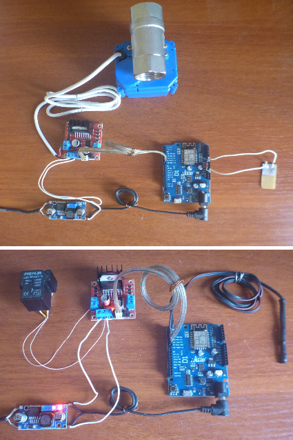

# Автоматизированная система мониторинга инженерных служб «Умного дома»

Проект системы защиты и мониторинга, направленный на повышение надежности и минимизацию затрат на содержание систем «Умного дома». Система обеспечивает постоянный контроль среды и оперативную реакцию на аварийные ситуации.

## 🎯 Цели и задачи
- **Повышение надежности:** Создание системы, устойчивой к перебоям в беспроводных сетях.
- **Безопасность:** Автоматическое предотвращение затоплений и утечек газа.
- **Экономичность:** Использование доступных и эффективных микроконтроллеров (ESP8266) в связке с центральным узлом на Raspberry Pi.

## 💡 Принцип работы (Логика)
Сбор данных происходит с помощью датчиков («нюх» устройства), которые фиксируют изменения параметров среды. Микроконтроллер обрабатывает эти сигналы и, в случае выхода параметров за установленные рамки, задействует исполнительные механизмы (блокировка газа/воды, включение реле), одновременно информируя пользователя.

## 🛠 Технологический стек
- **Верхний уровень:** Raspberry Pi Zero W (обработка, анализ и хранение данных).
- **Нижний уровень (периферия):** WeMos D1 (ESP8266) — сбор данных и управление механизмами.
- **Протоколы:** UDP (Wi-Fi) для передачи данных в реальном времени, I2C, 1-Wire.
- **Датчики:** MQ-2/MQ-7 (газ), DHT22/DS18B20 (температура), FC-37 (протечка воды).

## 📟 Описание реализованных стендов

В рамках работы были собраны и протестированы два функциональных стенда:

### Стенд №1: Система защиты от протечек
- **Компоненты:** WeMos D1, датчик протечки, шаровый кран с электроприводом, драйвер L297, стабилизатор 12В.
- **Алгоритм:** Контроллер в цикле измеряет электрическое сопротивление датчика. При обнаружении протечки подается сигнал на шаровый кран для перекрытия подачи воды. Данные о состоянии передаются на Raspberry Pi по UDP.

### Стенд №2: Контроль микроклимата (Отопление)
- **Компоненты:** WeMos D1, датчик температуры DS18B20, электромагнитное реле JQX-15F (220В/40A).
- **Алгоритм:** Контроллер сравнивает текущую температуру с заданной величиной. При отклонении активируется реле для управления нагревательным элементом. Уставки температуры можно менять удаленно через Raspberry Pi.

## 📸 Фото реализованной системы

## 📂 Структура репозитория
- `/src/esp8266` — прошивки для микроконтроллеров (C++/Arduino).
- `/images` — фотографии стендов и схем.
